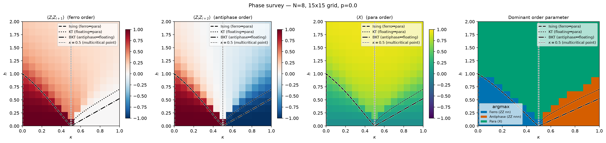
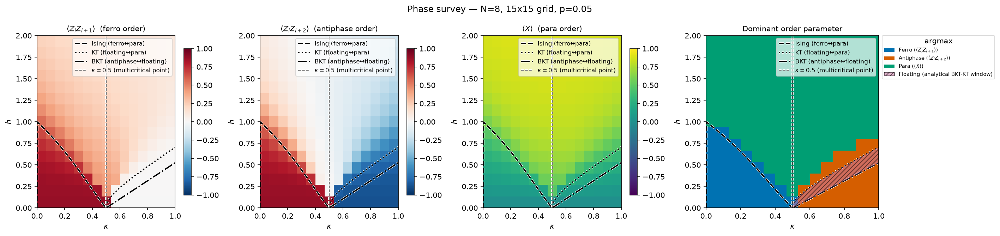

# Mapping the ANNNI Phase Diagram Under Depolarizing Noise

**Team aoeuhtns:** eogito, yyh, aoeuhtns, crackohead

**QSITE Hacks 2026 — Scientific Track**

## Abstract

We investigate how depolarizing noise changes the observed finite-size phase diagram of the one-dimensional axial next-nearest-neighbor Ising (ANNNI) model, because noise can bias phase identification on quantum devices. Using PennyLane, we exactly diagonalize an eight-qubit periodic ANNNI Hamiltonian on a $15\times15$ grid spanning $0\leq\kappa\leq1$ and $0\leq h\leq2$, then apply one layer of single-qubit depolarizing channels after ideal state preparation. We compare $p=0.01$ and $p=0.05$ with the clean $p=0$ baseline and analytical reference curves. Our primary metric is the shift in the field $h$ where spin correlations or transverse magnetization cross a fixed threshold. At $\kappa\approx0.29$, the ferromagnetic-to-paramagnetic proxy shifts from $h=0.692$ to $h=0.608$ at $p=0.05$. These deterministic simulator results have no shot-sampling uncertainty, but finite size, grid spacing, threshold choice, and post-preparation noise limit claims about noisy-circuit robustness and the floating phase.

## 1. Model and scientific objective

The ANNNI model is a simple setting in which ferromagnetism, frustration, and a transverse field compete. In the convention used by our starter kit, the Hamiltonian is

\[
H=-\sum_i Z_iZ_{i+1}+\kappa\sum_i Z_iZ_{i+2}-h\sum_i X_i,
\]

with periodic boundary conditions and nearest-neighbor coupling $J_1=1$. The first term favors ferromagnetic alignment, the positive next-nearest-neighbor term frustrates that order, and the transverse field rotates spins away from the $Z$ basis. At low field, the expected ordered phase is ferromagnetic for $\kappa<0.5$ and an up-up-down-down antiphase for $\kappa>0.5$. At sufficiently large $h$, the transverse field produces a paramagnetic phase. In the thermodynamic limit, a narrow incommensurate floating phase lies between the antiphase and paramagnetic regimes for $\kappa>0.5$.

Our main question is: **how does depolarizing noise change the observable phase portrait and the phase boundaries inferred from finite-size order parameters?** We focus on two practical issues. First, we quantify shifts in boundaries obtained from fixed order-parameter thresholds. Second, we determine which conclusions about phase robustness are justified by the specific noise model used in the notebook.

## 2. Methods

### Exact ground states and observables

We encoded each spin as a qubit, constructed the Hamiltonian with PennyLane 0.44.1, and used classical exact diagonalization to obtain its lowest-energy eigenstate at every grid point. The main scan used $N=8$ qubits and a $15\times15$ uniform grid. We loaded each exact state with `qml.StatePrep` for noisy measurements; the main scan has no variational circuit. Exact diagonalization avoids optimization error and gives a controlled finite-size reference, although it scales exponentially with $N$.

Raw longitudinal magnetization $\langle Z_i\rangle$ is unreliable in a small symmetric system because the exact ground state can preserve the global $\mathbb Z_2$ symmetry. We therefore used correlation-based observables:

- $C_1=\frac1N\sum_i\langle Z_iZ_{i+1}\rangle$, which is large and positive in the ferromagnetic regime;
- $C_2=\frac1N\sum_i\langle Z_iZ_{i+2}\rangle$, which becomes strongly negative in the antiphase regime;
- $M_x=\frac1N\sum_i\langle X_i\rangle$, which is large in the paramagnetic regime.

For visualization, each grid point was assigned the label associated with the largest score among $C_1$, $-C_2$, and $M_x$. This argmax map is only a compact summary: it has no independent floating-phase label. We therefore overlaid the analytical BKT–KT window as a hatched region rather than claiming to detect it from the three-way classifier.

### Noise model

The challenge specifies a depolarizing channel on the target qubit after every CNOT. Because the exact-diagonalization pipeline does not contain an explicit state-preparation circuit, we used a documented proxy: prepare the exact ground state on `default.mixed`, then apply one ring of depolarizing channels, one event per qubit. Thus `NOISE_LAYERS = 1` represents one assumed entangling layer. We evaluated $p=0$, $0.01$, and $0.05$.

This is a useful measurement-level stress test, but it is not equivalent to optimizing or executing a noisy VQE circuit. In the Heisenberg picture, PennyLane's single-qubit depolarizing channel rescales a Pauli operator by

\[
P\longrightarrow\left(1-\frac{4p}{3}\right)P.
\]

Consequently, a $k$-qubit Pauli string is suppressed by $\left(1-4p/3\right)^k$, independent of the underlying phase. This property is central to interpreting the results.

### Boundary estimates

We estimated boundaries by linearly interpolating the first crossing of a fixed absolute threshold of $0.5$: falling $C_1$ for the Ising boundary, falling $-C_2$ for the BKT boundary, and rising $M_x$ for the KT boundary. An absolute threshold is required here because a threshold normalized to the $h=0$ value would be invariant under the multiplicative noise channel and would report no noise-induced shift. The estimates should be interpreted as finite-grid crossovers rather than precise thermodynamic critical points.

### Experimental design

We hypothesized that the fixed-threshold estimates would shift as noise attenuated the observables, while the two-qubit $C_1$ and $C_2$ correlators would have the same fractional decay under this proxy. The clean $p=0$ calculation is the numerical baseline; analytical phase-boundary curves provide qualitative reference lines. We compared boundary locations in $h$ and the attenuation of $C_1$, $C_2$, and $M_x$ across the three noise levels. Noisy measurements used the `default.mixed` simulator; no quantum hardware was used. Exact expectation values and deterministic diagonalization required neither measurement shots nor random seeds.

## 3. Results

The clean phase portrait reproduced the expected large-scale organization of the ANNNI model. Ferromagnetic order dominated at low $h$ and $\kappa<0.5$, antiphase order appeared at low $h$ and $\kappa>0.5$, and transverse magnetization dominated at high field. The numerical crossover regions tracked the analytical curves qualitatively, with visible finite-size and discretization offsets.



At $p=0.01$, the categorical argmax map was unchanged at the resolution of the scan. At $p=0.05$, only one grid cell near $\kappa=1$ changed classification. The corresponding plotted antiphase-to-paramagnetic boundary moved from approximately $h=0.93$ to $h=0.86$. The continuous observables nevertheless weakened throughout the diagram, showing that a nearly unchanged categorical map can hide substantial degradation.



The fixed-threshold analysis revealed systematic shifts that were finer than the categorical grid labels. Representative estimates are shown below.

These are deterministic interpolated estimates, so shot-based error bars do not apply. Their systematic sensitivity to $N=8$, the $h$-grid spacing of about $0.143$, and the chosen threshold was not quantified by additional sweeps.

| Boundary | $\kappa$ | $h$ at $p=0$ | $h$ at $p=0.01$ | $h$ at $p=0.05$ | Shift at $p=0.05$ |
|---|---:|---:|---:|---:|---:|
| Ising: ferro → para | 0.29 | 0.692 | 0.677 | 0.608 | $-0.084$ |
| BKT proxy: antiphase → floating | 0.79 | 0.686 | 0.676 | 0.632 | $-0.054$ |
| KT proxy: floating → para | 0.79 | 0.517 | 0.522 | 0.541 | $+0.024$ |

The Ising and BKT threshold crossings move toward $h=0$, indicating that less field is required for the noisy two-point order parameters to fall below the fixed threshold. The KT proxy moves in the opposite direction because the single-qubit $M_x$ saturation value is also suppressed; a larger field is required for it to rise above the same absolute threshold. Across the sampled Ising slices, the largest absolute shift occurred near $\kappa\approx0.07$, where the boundary moved from $1.085$ to $0.979$ ($-0.106$). Near the challenge's representative $\kappa\approx0.3$ slice, the shift was $0.692\rightarrow0.608$ ($-0.084$).

At $p=0.05$, the predicted suppression of a two-qubit correlator is

\[
\left(1-\frac{4(0.05)}{3}\right)^2=0.8711,
\]

corresponding to a $12.9\%$ reduction. The notebook verifies this ratio numerically for both the ferromagnetic $C_1$ and antiphase $C_2$ correlators. The one-qubit observable $M_x$ is suppressed only by $1-4p/3=0.9333$, or $6.7\%$. This explains why antiphase order decreases about twice as much as transverse magnetization in the heatmaps. It does **not** imply that antiphase order is less robust than ferromagnetic order: both are two-qubit Pauli correlators and decay by exactly the same factor in this model.

## 4. Floating phase and limitations

Our attempted four-phase classifier searched the $\kappa>0.5$ region for points where neither $-C_2$ nor $M_x$ was strong. It assigned zero grid area to the floating phase at every noise level. The best candidate point, $\kappa=0.57, h=0.29$, still had $\max(-C_2,M_x)\approx0.61$. Similarly, subtracting the independently thresholded BKT and KT locations produced negative apparent window widths for $\kappa\geq0.7$. These negative widths are not physical. They show that the two smooth finite-size crossovers overlap and that a common threshold on local observables cannot isolate the narrow floating regime.

The main limitations are therefore:

1. **Finite size and coarse resolution.** Eight qubits and a $15\times15$ grid broaden transitions and shift them away from thermodynamic-limit curves.
2. **Post-hoc noise.** Applying identical channels after exact state preparation makes Pauli-string decay analytically state-independent. Boundary shifts reflect observable length and local profile slope, not how noise interacts with the circuit required to create each phase.
3. **Threshold dependence.** A fixed value of $0.5$ gives reproducible comparisons but is not a universal definition of a phase boundary.
4. **No direct floating-phase diagnostic.** Detecting incommensurate quasi-long-range order requires a structure factor, correlation decay with distance, fidelity susceptibility, or larger systems.

## 5. Conclusion

We produced clean and noisy finite-size phase maps of the ANNNI model that recover the expected ferromagnetic, antiphase, and paramagnetic regions. Depolarizing noise visibly suppresses all measured order parameters and shifts fixed-threshold estimates: ordered-region boundaries move inward, while the transverse-magnetization crossing moves outward. The ferro-to-para proxy at $\kappa\approx0.29$ shifts from $h=0.692$ to $0.608$ at $p=0.05$.

The most important interpretive result is that our current model cannot rank ferromagnetic and antiphase robustness: their two-qubit correlators both acquire the same factor $\left(1-4p/3\right)^2$. A stronger follow-up would optimize a hardware-efficient VQE ansatz independently at each grid point while inserting depolarizing channels after its CNOT gates. In that circuit-level model, noise would affect the preparation dynamics and entanglement structure rather than merely rescale final observables. Larger-$N$ calculations combined with a momentum-space structure factor would also provide a more defensible test of whether the floating phase survives noise.

## Reproducibility

The implementation is in `starter.ipynb`; it saves the figures alongside the notebook. It uses Python 3.14, PennyLane 0.44.1, NumPy, Matplotlib, and the local `starter_kit`. The primary scan parameters are `GRID_N = 8`, `GRID_RES = 15`, `NOISE_LAYERS = 1`, and `noise_ps = [0.0, 0.01, 0.05]`. From the `Scientific Track` directory, reproduce the notebook outputs with:

```sh
uv sync --locked
uv run jupyter nbconvert --to notebook --execute starter.ipynb --output starter_reproduced.ipynb
```

**Team contributions:** eogito — computational implementation; yyh — manuscript review and scientific editing; aoeuhtns — project coordination; crackohead — model development.

## References

1. PennyLane, [ANNNI Phase Detection](https://pennylane.ai/qml/demos/tutorial_annni).
2. PennyLane, [A Noisy Heisenberg Model](https://pennylane.ai/challenges/heisenberg_model).
3. PennyLane, [Seeing Quantum Phase Transitions](https://pennylane.ai/qml/demos/tutorial_quantum_phase_transitions).
4. S. Monaco *et al.*, “Quantum phase detection generalization from marginal quantum neural network models,” *Physical Review B* **107**, L081105 (2023).
5. M. Cea *et al.*, “Exploring the Phase Diagram of the quantum one-dimensional ANNNI model,” arXiv:2402.11022 (2024).
